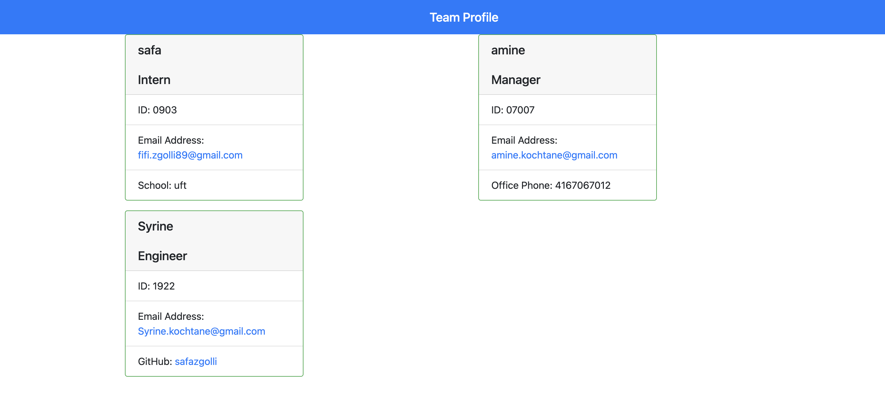
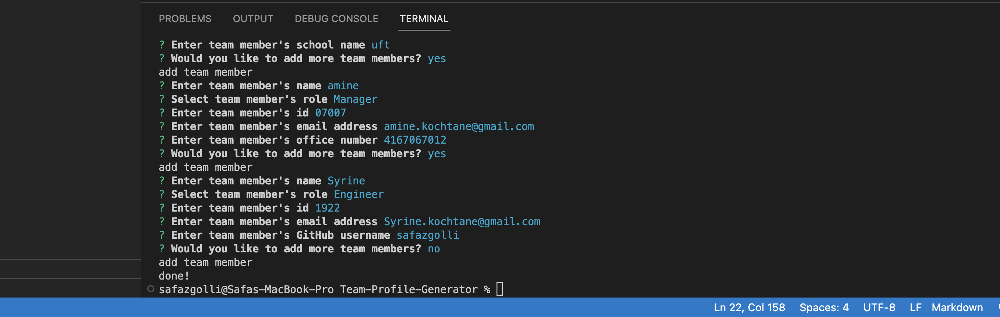

# Team-Profile-Generator

## Description:
application that  generate a webpage that displays  team's basic info, SO the user  can have quick access to their emails and GitHub profiles.

* a command-line application that accepts user input
* If  I am prompted for my team members and their information, an HTML file is generated that displays a nicely formatted team roster based on user input.
* If I click on an email address in the HTML, my default email program opens and populates the TO field of the email with the address.
* If I click on the GitHub username, that GitHub profile opens in a new tab.
* If I start the application, I am prompted to enter the team manager’s name, employee ID, email address, and office number.
* If I enter the team manager’s name, employee ID, email address, and office number, I am presented with a menu with the option to add an engineer or an intern or to finish building my team.
* If I select the engineer option, I am prompted to enter the engineer’s name, ID, email, and GitHub username, and I am taken back to the menu.
* If I select the intern option, I am prompted to enter the intern’s name, ID, email, and school, and I am taken back to the menu.
* If I decide to finish building my team, I exit the application, and the HTML is generated.

### Walkthrough Video:
 
 https://drive.google.com/file/d/1yzepoSx6HTz-m6APXlyPFggUxw6pW2JL/view

 ### Pictures :
 The following image shows a mock-up of the generated HTML’s appearance and functionality:

 

 

  
